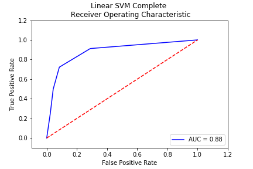
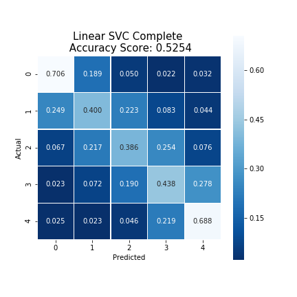

# yelp-sentiment-analysis-backend
Yelp Rating Prediction Based on Text Review Sentiment Analysis

Abstract
------------------

Yelp releases a dataset of business data, review text data, user data, checkin data, tips, and photos. Using this data, it would be meaningful if we could take a random sample of reviews and train classifiers to determine the sentiment of reviews in order to predict ratings based solely on review's text. This can hopefully be done by cleaning the dataset up and utilizing the bag-of-words model. Once the data is preprocessed we should be able to train the models using set python libraries and evaluate the efficiency of the models on determining the sentiment of each review. The sentiment analysis of a full set of reviews will allow us to gauge the public opinion of a facility and predict a rating.

Basic Steps Involved
--------------------

-   Access Yelp dataset JSON
-   Isolate review JSON data
    -   Remove unnecessary JSON data to reduce file size
-   Preprocess data
    -   Remove punctuation
    -   Remove spaces
    -   Remove minor words ("the", "a", "an", etc.)
    -   Remove low sentiment words
    -   Convert corpus to lowercase to avoid redundancy
    -   Convert corpus to bag-of-words vector format
-   Convert reviews into a countable vector
-   Split Yelp dataset into a smaller training dataset
-   Train multiple models
    -   Naive Bayes
    -   SVC
    -   SVM
    -   Logistic Regression
    -   Neural Network
    -   Random Forest
    -   Artificial Neural Network
-   Test and evaluate models
-   Use review sentiment models to predict rating

Tech Stack
--------
-   Python (Jupyter Notebook)
-   [CoreNLP](https://stanfordnlp.github.io/CoreNLP/)
-   [Glob](https://github.com/python/cpython/blob/2.7/Lib/glob.py)
-   [JSON Simple](https://code.google.com/archive/p/json-simple/)
-   [Keras](https://keras.io/)
-   [Matplotlib](https://matplotlib.org/)
-   [NLTK](http://www.nltk.org/)
-   [Numpy](http://www.numpy.org/)
-   [OS](https://docs.python.org/3/library/os.html)
-   [Pandas](https://pandas.pydata.org/)
-   [Random](https://docs.python.org/3/library/random.html)
-   [Seaborn](https://seaborn.pydata.org/)
-   [Scikit-Learn](http://scikit-learn.org/stable/install.html)
-   [Scipy](https://docs.scipy.org/doc/scipy/reference/)
-   [String](https://docs.python.org/2/library/string.html)
-   [Time](https://docs.python.org/2/library/time.html)
-   [WordCloud](https://github.com/amueller/word_cloud)
-   yelp\_academic\_dataset\_review.json

Overview
--------

In order to perform sentiment analysis on the yelp dataset, it's important to first look at the dataset's structure and determine what methods need to be applied to the dataset to clean it and enhance its utility. For the yelp dataset we are presented with a data structure as shown:

| business\_id | date       | review\_id | stars | text               | type   | user\_id | cool | useful | funny |
|--------------|:-----------|------------|-------|:-------------------|:-------|----------|------|--------|-------|
| 9yKzy9PA...  | 2011-01-26 | fWKvX8...  | 5     | My wife took me... | review | rLtl...  | 2    | 5      | 0     |
| ZRJwVLyz...  | 2011-07-27 | IjZ33s...  | 5     | I have no idea...  | review | 0a2K...  | 0    | 0      | 0     |
| 6oRAC4uy...  | 2012-06-14 | IESLBz...  | 4     | love the gyro...   | review | 0hT2...  | 0    | 1      | 0     |

For the most part the organization and utility are favorable, however; in order to perform some comparisons it may be important to determine the length of the 'text' column and also pre-process that data. This would allow me to take a bag of words approach to the problem at hand.

### Bag-of-Words

The bag-of-words model is a simplifying representation used in natural language processing. In this model, a text (such as a review) is represented as the bag (multiset) of its words, disregarding grammar, stopwords, and even word order but keeping multiplicity.

### Text Pre-processing and Tokenizing

As shown in the yelp dataset’s fifth column, 'text', our review text data is presented as a string of words. This presents an issue with sentiment analysis, as we have no mechanism at this point to determine if a string of words is inherently positive or negative in nature. In order to do this I took the bag-of-words approach, which requires each review string to be separated into a list of single words.

`My wife took me here on my birthday for breakfast and it was excellent.  The weather was perfect which made sitting outside overlooking their grounds an absolute pleasure.`

`['wife', 'took', 'birthday', 'breakfast', 'excellent', 'weather', 'perfect', 'made', 'sitting', 'outside', 'overlooking', 'grounds', 'absolute', 'pleasure']`

Using my text\_process function this is easily performed.

``` python
def text_process(text, weak_sentiment_word_list):
    # instantiate word_list array
    word_list = []
    
    # parse characters of text and remove punctuation
    nopunc = [char for char in text if char not in string.punctuation]
    nopunc = ''.join(nopunc)
    
    # parse word by word in text convert to lowercase and remove 
    # stopwords and weak sentiment words
    for word in nopunc.split():
        word = word.lower()
        if word not in stopwords.words('english'):
            if word not in weak_sentiment_word_list:
                word_list.append(word.lower())
        
    return word_list
```

The function takes a string and a list as an argument and parses it character by character, in the event that it encounters a punctuation character it is removed. Then the function parses the entire string word by word removing any stopwords or weak sentiment words encountered. It is important to remove stop words as they are a set of words that enhance readability, but do not necessarily add to the sentiment of a phrase so they likely are wasting processing time and reducing the accuracy of future models. It is also important to remove words that do not have strong sentiment attached to them as they also likely are wasting processing time and reducing the accuracy of future models.

``` python
def clean_dataset(yelp):
    # instantiate a weak_sentiment_list array
    weak_sentiment_list = []
    
    # retype text to string 
    yelp['text'] = yelp['text'].astype(str)
    
    # create length and tokenized columns 
    yelp['length'] = yelp['text'].apply(len)
    yelp['tokenized'] = yelp.apply(lambda row: text_process(row['text'], 
                          weak_sentiment_list), axis=1)
    
    # generate a weak sentiment word list and apply it to the tokenized column
    weak_sentiment_list = generate_weak_sentiment_list(yelp)
    yelp['tokenized'] = yelp.apply(lambda row: text_process(row['text'], 
                          weak_sentiment_list), axis=1)
    
    return yelp, weak_sentiment_list
```

This preprocessing takes place durring the text cleaning cycle, as performed by the function clean\_dataset. This first prepares the text column by re-typing it as a string, along with creating a new column, length, to store the length of each review text for data analysis and comparison in the next step. Then text\_prossess is called and this vector of words is saved in another new column 'tokenized'. After this we can call generate\_weak\_sentiment\_list to generate a list of words with high counts that appear in both the strongly positive and strongly negative case. Once the weak sentiment list is created text\_prossess is called a second time to remove all unnecessary words.

Producing a clean and processed dataset, as shown below.


Primary Analysis
----------------

From the start of this project I intended on comparing the 'star' column to the 'tokenized' column. However, it is important to determine if there are any other strong correlations between other variables in the dataset. My initial approach was to relate the 'star' column to the newly created 'length' column, mainly to show if there is a relationship between the length of reviews with respect to the star rating of the review.


I then wanted to determine if there was a clear bias in star count in the entire dataset.


From this histogram it is apparent that there is a well defined bias towards the upper end of the charts, the vast majority of reviews are 4 or 5 stars. This tells us that there is a strong likelihood that our models will have a bias towards positive sentiment over negative sentiment, and will have to be corrected.

``` python
def normalize_dataset(yelp):
    # instantiate yelp_normalized array
    yelp_normalized = []
    
    # create datasets separated by type of star
    yelp_1 = yelp[(yelp['stars'] == 1)]
    yelp_2 = yelp[(yelp['stars'] == 2)]
    yelp_3 = yelp[(yelp['stars'] == 3)]
    yelp_4 = yelp[(yelp['stars'] == 4)]
    yelp_5 = yelp[(yelp['stars'] == 5)]
    
    # determine the lowest count in datasets
    limiting_factor = min([len(yelp_1), len(yelp_2), len(yelp_3), len(yelp_4), len(yelp_5)])
        
    # concatenate all datasets into one dataset
    yelp_normalized.append(yelp_1.sample(limiting_factor))
    yelp_normalized.append(yelp_2.sample(limiting_factor))
    yelp_normalized.append(yelp_3.sample(limiting_factor))
    yelp_normalized.append(yelp_4.sample(limiting_factor))
    yelp_normalized.append(yelp_5.sample(limiting_factor))
    
    return pd.concat(yelp_normalized)
```

The method I chose to correct this bias is to perform a form of normalization on the entire set of yelp data. This was performed with the normalize\_dataset function which compares the count of each star rating and then samples the lowest count from each set. This guarantees an equal distribution of all star ratings, meaning the bias towards large numbers has been eliminated.


After establishing from the graphs that there is not likely a strong connection between length of review with the star I decided to determine the correlations between all variables in the dataset. I first took the mean of the dataset with respect to the stars in order to prepare the dataset to undergo correlation.


Showing us that some of the variables in the dataset might be correlated with each other.


These correlations are more apparent in the pairwise plot, below. Showing us that there appears to be a strong linear relationship between the 'cool' column and 'useful' column and to a lesser degree between the 'cool' column and 'useful' column along with the 'useful' column and 'funny' columns. These are correlations that I might want to look into in the future.

All three of these columns make sense to have some degree of correlation with respect to each other, so the data represents intuition. The pairwise plot, however; does not show the correlation between the 'stars' column and the others as the 'stars' column holds discrete values rather than continuous points, so their correlation plots are striated.


Since, I am performing a bag of words approach to the review text I decided to generate two word clouds in order to have a graphical representation of each words sentiment. I generated these graphs by taking the bag of words for all the 1 star reviews and 5 star reviews, as representations of strongly positive reviews and strongly negative reviews. These graphs also indicate that there are a few non-stop words that have very little effect on the sentiment of a review.


This analysis lead me to perform a secondary cleaning to remove words with similar rank in both sets. Producing a much cleaner word clouds.


Classification
--------------

In order to train my models I first needed to prepare my data, so I duplicated my dataset into two separate classes, boundary and complete. This was performed by running the create\_class function on the yelp dataset.

-   **Boundary**: Dataset containing only the data of 1 star reviews and 5 star reviews
-   **Complete**: Dataset containing the data of all reviews

Doing this allowed me to test and train all my models in both environments, showing definitively that, for sentiment analysis, it is more efficient and accurate to train on edge cases. This makes logical sense as 1 and 5 star reviews are only generated from people with strongly positive or strongly negative opinions, ideally.

Once I had two separate full datasets, I needed to separate them into training and test sets Before this I needed to generate X and y, the dataframe of the 'text' and 'stars' column, using the generate\_X\_y function.

With two classes of X dataframes this data then needed to be transformed by the bow\_transformer function.

``` python
def bow_transformer(X):
    # vectorize words in X with an ngram of 1 and setting a feature ceiling at 450,000 
    # the feature ceiling was set to extend the boundary case without conflicts
    bow_transformer = count_vectorizer(ngram_range=(1, 2), max_features=450000).fit(X)
    
    # transform vectorize words
    X = bow_transformer.transform(X)
    
    return X
```

This function takes a dataframe and performs a count vectorizer using the data and a pre-processor. Once the word vector is ranked by count it is then transformed by the bow\_transformer. This will return the same dataframe organized in such a way that now models will be able to be trained on the data.

The final step of generating training and test sets is to then run our new X and y with train\_test\_split function from Scikit-Learn. This will generate X\_complete\_train, X\_complete\_test, y\_complete\_train, y\_complete\_test and X\_boundary\_train, X\_boundary\_test, y\_boundary\_train, y\_boundary\_test for each class respectively.

#### Multinomial Naive Bayes Classifier

Using Scikit-Learn's multinomial\_nb function, I generated this classifier and used it's built in functions in order to train the model.

``` python
# create and train multinomial naive bayes classifier
classifier_nb_complete = multinomial_nb()
classifier_nb_complete, prediction_nb_complete, time_train_nb_complete, time_predict_nb_complete, score_nb_complete, confusion_matrix_nb_complete = classifier_train(classifier_nb_complete, X_complete_train, y_complete_train, X_complete_test, y_complete_test)
# evaluate and plot the confusion matrix
classifier_string_nb_complete = 'Multinomial Naive Bayes Complete'
classifier_result(confusion_matrix_nb_complete, score_nb_complete, classifier_string_nb_complete)
# evaluate and plot the roc curve
fpr_nb_complete, tpr_nb_complete, thresholds_nb_complete, roc_auc_nb_complete = classifier_roc(prediction_nb_complete, y_complete_test, classifier_string_nb_complete)
```

Using classifier\_train I was able to monitor the time it took to train and predict, so that I could include efficiency as a mechanism for determining the ideal classifier. While classifier\_result and classifier\_roc were used to generate the confusion matrix and ROC curve for this classifier.

#### Linear Support Vector Machine Classification

The implementation of this classifier is based on libsvm according to Scikit-Learn's svm library. I used this library along with SVC and a linear kernel in order to generated this classifier and then I used it's built in functions in order to train the model.

``` python
# create and train linear svm classifier
classifier_ln_complete = svm.SVC(kernel='linear')
classifier_ln_complete, prediction_ln_complete, time_train_ln_complete, time_predict_ln_complete, score_ln_complete, confusion_matrix_ln_complete = classifier_train(classifier_ln_complete, X_complete_train, y_complete_train, X_complete_test, y_complete_test)
# evaluate and plot the confusion matrix
classifier_string_ln_complete = 'Linear SVM Complete'
classifier_result(confusion_matrix_ln_complete, score_ln_complete, classifier_string_ln_complete)
# evaluate and plot the roc curve
fpr_ln_complete, tpr_ln_complete, thresholds_ln_complete, roc_auc_ln_complete = classifier_roc(prediction_ln_complete, y_complete_test, classifier_string_ln_complete)
```

Using classifier\_train I was able to monitor the time it took to train and predict, so that I could include efficiency as a mechanism for determining the ideal classifier. While classifier\_result and classifier\_roc were used to generate the confusion matrix and ROC curve for this classifier.

#### Linear Support Vector Classification

Similar to SVC with parameter kernel=’linear’, but implemented in terms of liblinear rather than libsvm, so it has more flexibility in the choice of penalties and loss functions and should scale better to large numbers of samples. I used this library along with the LinearSVC function in order to generated this classifier and then I used it's built in functions in order to train the model.

``` python
# create and train linear svc classifier
classifier_lnlib_complete = svm.LinearSVC()
classifier_lnlib_complete, prediction_lnlib_complete, time_train_lnlib_complete, time_predict_lnlib_complete, score_lnlib_complete, confusion_matrix_lnlib_complete = classifier_train(classifier_lnlib_complete, X_complete_train, y_complete_train, X_complete_test, y_complete_test)
# evaluate and plot the confusion matrix
classifier_string_lnlib_complete = 'Linear SVC Complete'
classifier_result(confusion_matrix_lnlib_complete, score_lnlib_complete, classifier_string_lnlib_complete)
# evaluate and plot the roc curve
fpr_lnlib_complete, tpr_lnlib_complete, thresholds_lnlib_complete, roc_auc_lnlib_complete = classifier_roc(prediction_lnlib_complete, y_complete_test, classifier_string_lnlib_complete)
```

Using classifier\_train I was able to monitor the time it took to train and predict, so that I could include efficiency as a mechanism for determining the ideal classifier. While classifier\_result and classifier\_roc were used to generate the confusion matrix and ROC curve for this classifier.

#### Logistic Regression Classifier

Using Scikit-Learn's LogisticRegression function, I generated this classifier and used it's built in functions in order to train the model.

``` python
# create and train logistic regression classifier
classifier_lr_complete = LogisticRegression()
classifier_lr_complete, prediction_lr_complete, time_train_lr_complete, time_predict_lr_complete, score_lr_complete, confusion_matrix_lr_complete = classifier_train(classifier_lr_complete, X_complete_train, y_complete_train, X_complete_test, y_complete_test)
# evaluate and plot the confusion matrix
classifier_string_lr_complete = 'Logistic Regression Complete'
classifier_result(confusion_matrix_lr_complete, score_lr_complete, classifier_string_lr_complete)
# evaluate and plot the roc curve
fpr_lr_complete, tpr_lr_complete, thresholds_lr_complete, roc_auc_lr_complete = classifier_roc(prediction_lr_complete, y_complete_test, classifier_string_lr_complete)
```

Using classifier\_train I was able to monitor the time it took to train and predict, so that I could include efficiency as a mechanism for determining the ideal classifier. While classifier\_result and classifier\_roc were used to generate the confusion matrix and ROC curve for this classifier.

#### Random Forest Classification

Using Scikit-Learn's RandomForestClassifier function, I was able to generate a random forest classifier in order to train the model. I chose to select 100 n\_estimators as a random initial test condition. In the future I plan on performing a true test to optimize the n\_estimators; however, for this run I simply selected a value to run the classifier. I also chose to activate bootstrap and oob\_score for this classifier, as bootstrap causes each new tree to be based slightly on its predecessor rather than randomly generating trees. Potentially yielding better results faster. And I also chose to enable the Out-of-bag score estimate so that I had a baseline to compare the results against.

``` python
# create and train random forest classifier with 100 estimators and bootstrapping enabled
classifier_rfc_complete = RandomForestClassifier(n_estimators=100, bootstrap=True, oob_score=True, random_state=0)
classifier_rfc_complete, prediction_rfc_complete, time_train_rfc_complete, time_predict_rfc_complete, score_rfc_complete, confusion_matrix_rfc_complete = classifier_train(classifier_rfc_complete, X_complete_train, y_complete_train, X_complete_test, y_complete_test)
print('\n')
print('Out-of-bag score estimate: {0:.3f}'.format(classifier_rfc_complete.oob_score_))
# evaluate and plot the confusion matrix
classifier_string_rfc_complete = 'Random Forest Classifier Complete'
classifier_result(confusion_matrix_rfc_complete, score_rfc_complete, classifier_string_rfc_complete)
# evaluate and plot the roc curve
fpr_rfc_complete, tpr_rfc_complete, thresholds_rfc_complete, roc_auc_rfc_complete = classifier_roc(prediction_rfc_complete, y_complete_test, classifier_string_rfc_complete)
```

Using classifier\_train I was able to monitor the time it took to train and predict, so that I could include efficiency as a mechanism for determining the ideal classifier. While classifier\_result and classifier\_roc were used to generate the confusion matrix and ROC curve for this classifier.

#### Artificial Neural Network Classification

Using Keras's Sequential function along with their dense layer and activation layer functions I was able to train a this classifier. I chose to design a neural network that ran 2 epochs, as I was running locally and trying to keep the training time down on my local machine. I also chose to design this neural network to contain 2 dense layers, 2 activation layers, and a dropout layer.

The layers were chosen this way because the first dense layer is being used to weight each word and only activate it using a rectified linear unit activation function. This, ReLU, function has been shown to work efficiently which is pivotal when dealing with large numbers of words in order to train a model. I then decided to run a dropout function with a value of 0.5 in order to avoid overfitting. Then a second dense function which weighted the number of classes and activated using a softmax activation function. The purpose of this is that softmax can be used to represent a categorical distribution, which is exactly what we are training this model for.

``` python
# Set classes, input shape, batch size, and epochs
num_classes = 6
max_words = X_complete_train.shape[1]
batch_size = 32
epochs = 2
# create classifier and define network layers
classifier_nn_complete = Sequential()
classifier_nn_complete.add(Dense(32, input_shape=(max_words,)))
classifier_nn_complete.add(Activation('relu'))
classifier_nn_complete.add(Dropout(0.5))
classifier_nn_complete.add(Dense(num_classes))
classifier_nn_complete.add(Activation('softmax'))
# compile neural network
classifier_nn_complete.compile(loss='sparse_categorical_crossentropy',
                               optimizer='adam',
                               metrics=['accuracy'])
# train and evaluate neural network
classifier_nn_complete, prediction_nn_complete, time_train_nn_complete, time_predict_nn_complete, score_nn_complete, accuracy_nn_complete, confusion_matrix_nn_complete = classifier_train_nn(classifier_nn_complete, X_complete_train, y_complete_train, X_complete_test, y_complete_test, batch_size, epochs)
# evaluate and plot confusion matrix
classifier_string_nn_complete = 'Neural Network Classifier Complete'
classifier_result(confusion_matrix_nn_complete, accuracy_nn_complete, classifier_string_nn_complete)
# evaluate and plot the roc curve
fpr_nn_complete, tpr_nn_complete, thresholds_nn_complete, roc_auc_nn_complete = classifier_roc(prediction_nn_complete, y_complete_test, classifier_string_nn_complete)
```

Using classifier\_train\_nn I was able to monitor the time it took to train and predict, so that I could include efficiency as a mechanism for determining the ideal classifier. While classifier\_result and classifier\_roc were used to generate the confusion matrix and ROC curve for this classifier.

### Extending Boundary Classification

After training the classifier in both the complete case and the boundary case, I began extending the boundary case to predict in the complete case. This was done by utilizing the classifier\_evaluate function.

``` python
def classifier_evaluate(classifier, X_test, y_test):
    # set time and use the classifier to predict the test values  
    t0 = time.time()
    
    # generate the predictions and the probabilities attached to the predictions
    prediction = classifier.predict(X_test)
    prediction_probability = classifier.predict_proba(X_test)
    
    # parse the predictions and probabilities and based on find the difference in the probabilities
    for i in range(prediction.size):
        prediction_delta = prediction_probability[i][0] - prediction_probability[i][1]
        # based on the difference value set the star prediction
        if prediction_delta > 0.75:
            prediction[i] = 1
        elif prediction_delta > 0.25:
            prediction[i] = 2    
        elif prediction_delta > -0.25:
            prediction[i] = 3
        elif prediction_delta > -0.75:
            prediction[i] = 4
        else:
            prediction[i] = 5
    
    # set completion time
    t1 = time.time()
    
    # determine and prediction time
    time_predict = t1-t0
    
    # evaluate accuracy of the classifier based on the test case
    score = (prediction.size - np.count_nonzero(prediction - y_test.values)) / prediction.size
    print('Score: {0}'.format(score))
    print('\n')
    
    # evaluate the confusion matrix based on the predictions generated by the classifier
    confusion_matrix = metrics.confusion_matrix(y_test, prediction)
    print('Confusion Matrix: \n {0}'.format(confusion_matrix))
    print('\n')
    
    print('Prediction time: {0:.3f}s'.format(time_predict))
    print(classification_report(y_test, prediction))
    
    return classifier, prediction, time_predict, score, confusion_matrix
```

This function operates much like the classifier\_train function; however, it takes into account the probability attached to each prediction made. The predict\_proba function returns an array of arrays which contain a probability in each class. For the boundary case each probability array would contain two values, one referring to the probability of it being classified as a 1 and the other as a 5.

``` python
# generate the predictions and the probabilities attached to the predictions
prediction = classifier.predict_classes(X_test, verbose=1)
prediction_probability = classifier.predict(X_test)
```

A similar function to classifier\_train was created for the artificial neural network approach, classifier\_train\_nn. This is necessary keras does not operate exactly like sklearn.

Once the probabilities were found I set out to find the difference between the two. This value would represent a how close a prediction was to any value. The difference could span -1, a 5, all the way to 1, a 1. I chose to break the classes up into equal intervals, as to not bias the results more than necessary.

Once all the predictions were evaluated the score, accuracy, had to be measured. This was done by counting the correct predictions and dividing total prediction count.

Results
-------

Between the complete and boundary models, it appears that the complete model has a significantly lower accuracy along with a longer training time and prediction time compared to the boundary models. Holding true for every classifier thus far.

### Multinomial Naive Bayes Classifier

#### Complete


Analyzing the confusion matrix, it can be shown that the model is biased towards low and mid valued star ratings, 1 and 3 star ratings. This model was also shown to have an accuracy score of about 51.62%. For the complete case this is not very low; however, compared to the boundary case this is very low.

This model was able to train in 0.244 seconds and predict its set in 0.045s. Both of these metrics are impressively fast, but if a model cannot predict accurately this is less impressive.

The ROC curve and its corresponding AUC, area under the curve show us that this model has an area under the curve of 0.88 telling us that this model may be more accurate than previously expected. While the accuracy is sub-par the model is predicting at much higher than random guesses, 20%.

In accord with the confusion matrix it also is not ideal that the only star rating to predict at above 53% is in the 1 and 3 star case. This is a bias that may need explored more.

#### Boundary


Analyzing the confusion matrix, it can be shown that the model is also slightly biased towards low valued star ratings, 1 star ratings.

With an accuracy score of 92.96% this model appears to be on the lower end of the boundary accuracies. Along with having a subpar accuracy, with respect to the other boundary models, the training time for this model was 0.035 seconds, meaning that it was by far the lowest training time. Prediction time, 0.013 seconds, also is remarkable low, however; not the lowest of all the trials.

The ROC curve and its corresponding AUC, area under the curve, appear to also be rendering incorrectly. With this high of an accuracy, it would be expected to yield a strong ROC curve with a high AUC. This does not appear to be the case, indicating that there is something wrong with generating my ROC curve in all trials.

#### Boundary Extended


Analyzing the confusion matrix it is very clear that this model has a very strong bias towards predicting the 5 star case. This paired with an accuracy of 19.03% leads me to believe this of extrapolating from 2 classes into 5 classes is not sufficient.

### Linear Support Vector Machine Classification

#### Complete



From the confusion matrix it can be seen that linear SVM classification has a bias towards the extreme ratings, 1 and 5 star ratings. This tells us that this model has difficulties determining the sentiment of more neutral reviews. This result is not unexpected, but is still noteworthy.

From the confusion matrix we can see that this model was slightly more accurate than the multinomial naive bayes model. However, only by about 3%. An accuracy of 53.94% is an improvement, but in order to be able to use the complete set for sentiment analysis the model accuracy needs to be able to compete with the boundary accuracy.

Beyond having a low accuracy this model took 283.518 seconds to train and required 75.695 seconds to predict the whole set. This is very slow when compared to the previous model.

#### Boundary


This confusion matrix shows us that there is no clear bias towards positivity or negativity. Linear SVM classification in the boundary case appears to be a strong candidate with no clear bias and an accuracy of 94.66%. This is the most accurate model we have seen so far, but its downside is the training time required for this model, 9.282 seconds. With respect to the boundary case this is significantly longer than multinomial naive bayes, and it also has a slow prediction time of 3.298 seconds.

#### Boundary Extended


Analyzing the confusion matrix it is very clear that this model has a very strong bias towards predicting the 3 star case. This along with an accuracy of 19.35% leads me to believe this of extrapolating from 2 classes into 5 classes is also not sufficient for this classifier.

### Linear Support Vector Classification

#### Complete



Similar to linear SVM classification, SVC, has a bias towards the extreme ratings, 1 and 5 star ratings. This model also has an accuracy of 52.54%, again showing that SVM and SVC classifiers do not appear to be incredibly different for this project.

This model also had a training time of 27.419 seconds and a prediction time of 0.031 seconds. Differentiating it from SVM; however, with a low accuracy this low training and prediction time is not as powerful.

#### Boundary


This model was able to achieve an accuracy of 94.53%, placing it in the stronger model category. This model also does not appear to have a bias toward positivity or negativity, which is always favorable.

It was also able to train in 0.389 seconds and prediction in a staggering 0.003 seconds. This makes linear SVC one of the most efficient non-bias classifiers in the entire set.

#### Boundary Extended


Analyzing the confusion matrix it is very clear that this model has a very strong bias towards predicting the 3 star case. This along with an accuracy of 19.57% leads me to believe this of extrapolating from 2 classes into 5 classes is also not sufficient for this classifier.

### Logistic Regression

#### Complete


This model was able to predict at with an accuracy of 55.12%, making it one of the most accurate models trained in this experiment. It, just like most of the other complete models, has a clear bias in the confusion matrix. This array shows us that there is a strong bias towards extreme values, 1 and 5 star ratings.

This model was also able to be trained in 28.939 seconds. It also had a prediction time of 0.038 seconds.

#### Boundary


This classifier was able to predict with an accuracy of about 94.9%. This is not statistically impressive with respect to the other boundary classifiers. It also appears to have a very slight bias towards negative ratings over positive ratings.

The model does possess some strong characteristics. Such as a very fast training and prediction time, 1.064 seconds and 0.003 seconds respectively.

#### Boundary Extended


Analyzing the confusion matrix it is apparent that this model has a very strong bias towards predicting the 3 star case. This along with an accuracy of 19.46% leads me to believe this of extrapolating from 2 classes into 5 classes is also not sufficient for this classifier.

### Random Forest Classification

#### Complete


The random forest classifier was unable to produce an accurate tree while taking a statistically long training time. This model's accuracy is 51.86% despite requiring 2088.583 seconds to run. This may be due to the n\_estimators being arbitrarily set to 100. After discovering the ideal n\_estimators count, hopefully this model will be more accurate while taking less time to train.

Once trained the prediction time was 2.364 seconds, which is not a poor time with regards to the other complete models.

The confusion matrix for this model also indicates a strong bias towards the extremes with an even stronger bias towards negative ratings This may be an artifact of the classifier, or it could be solved when the n\_estimators is properly set.

#### Boundary


Again this type of model does not appear to be very successful with a boundary accuracy of about 92.18%. Similarly to the complete model, this model took a long time to run, 113.029 seconds. While not producing a strong model.

Strangely enough this model also has a noticeable bias towards negative ratings. Potentially indicating that this bias might be intrinsically related to the model itself.

This model once trained only took 0.570 seconds to run its predictions over the entire set. Yielding a decent prediction time.

#### Boundary Extended


Analyzing the confusion matrix it also has a very strong bias towards predicting the 3 star case. This along with an accuracy of 19.51% leads me to believe this of extrapolating from 2 classes into 5 classes is also not sufficient for this classifier.

### Artificial Neural Network Classification

#### Complete


Artificial neural networks were able to be tailored to the problem at hand more specifically than any other model, and their accuracy appears to reflect that. This model's accuracy was roughly 57.83% which is the most accurate model in the entire complete model set.

The model also does have some biases towards different ratings, 4 5 and 1 star ratings. It is not a strong bias, but it is noticeable. This may be avoided with increasing or decreasing the dropout layer’s effect.

The issue with neural networks is that they take some time to train. This one required 759.116 seconds to train and was able to predict at 62.661 seconds. Meaning that it is pretty slow, but not the absolute slowest.

#### Boundary


Just as the artificial neural network was the most accurate complete model, the boundary case performed with an accuracy higher than any other model. With an accuracy of 95.68% and no clear bias from the confusion matrix.

However, with a training time of 125.511 seconds. This model is slightly more slow than the random forest classifier, and with a slow prediction time of about 8.725 seconds this model is far from efficient.

#### Boundary Extended


Analyzing the confusion matrix it also has a very strong bias towards predicting the 3 and 4 star case. This along with an accuracy of 19.35% leads me to believe this of extrapolating from 2 classes into 5 classes is also not sufficient for this or any classifier.

### Conclusions

#### Complete


From these graphs we can see that there is only a slight variance in ROC area under the curves, which have been shown to correlate to the accuracy of the model. However we can see that there is a lot of variability with regard to the training times and prediction times of different models.

When only including accuracy and training time, it appears that multinomial naive bayes may be considered the most efficient model. However, I would be tempted to discredit it solely because of its intrinsic bias towards low rankings.

Personally I would venture to say that regardless of the training time and prediction times neural network classification is the most accurate while yielding the least amount of bias.

#### Boundary


Similarly to the complete case an argument could be made for multinomial naive bayes; however, in this case I would argue that this model is not not accurate enough to be considered efficient. There does appear to be a contender that has a relatively short training time, no noticeable bias, and high accuracy, linear SVC.

Again if we do not care about the prediction and training times neural network achieves the highest accuracy. However, I believe that there is a claim that can be made for linear SVC.

#### Boundary Extended


In the extended boundary case I attempted to extend the boundary case from 2 classes into all 5 classes. This attempt was unsuccessful as no classifier achieved an accuracy higher than the baseline case of 20%, randomly 1 out of 5.

The only notable thing produced from this trial is that the effort to extend into all 5 classes causes prediction time to increase, as the model and predictions have to be reworked slightly.

In the future I believe that the boundary case may be successfully extended into all 5 cases; potentially by assigning each rating based on more metrics than just the probability difference between 1 and 5. It may also be useful to implement a secondary classification method which takes the probabilities as inputs and classifies 1 to 5 based on those two values.

References
----------

[Automatic Business Attribute Labeling from Yelp Reviews](https://pdfs.semanticscholar.org/3326/31c5bb936e7bbc8ae632d26ba70a3c780ee8.pdf)

[Medium - Sentiment analysis for Yelp review classification](https://medium.com/tensorist/classifying-yelp-reviews-using-nltk-and-scikit-learn-c58e71e962d9)

[NYC Data Science Academy - Sentiment Analysis Of Yelp User Review Data](https://nycdatascience.com/blog/student-works/sentiment-analysis-yelp-user-review-data/)

[Sentiment Analysis of Yelp‘s Ratings Based on Text Reviews](http://cs229.stanford.edu/proj2014/Yun%20Xu,%20Xinhui%20Wu,%20Qinxia%20Wang,%20Sentiment%20Analysis%20of%20Yelp's%20Ratings%20Based%20on%20Text%20Reviews.pdf)

[Yelp Dataset Documentation](https://www.yelp.com/dataset/documentation/json)
